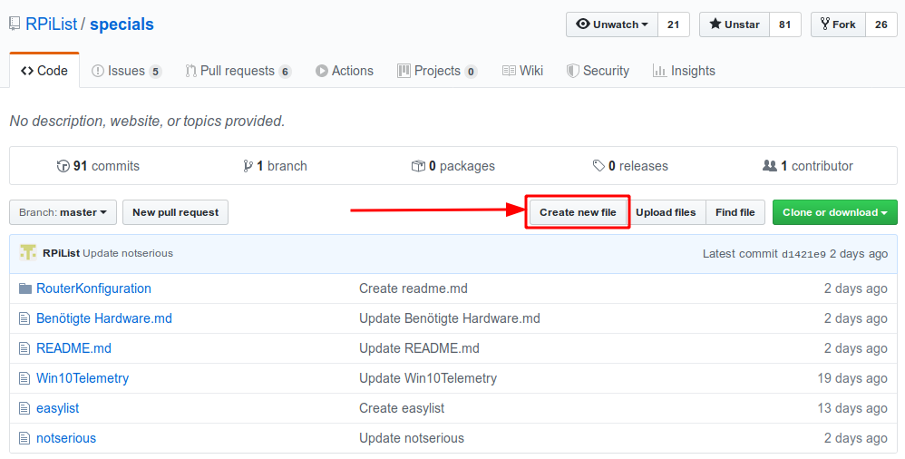
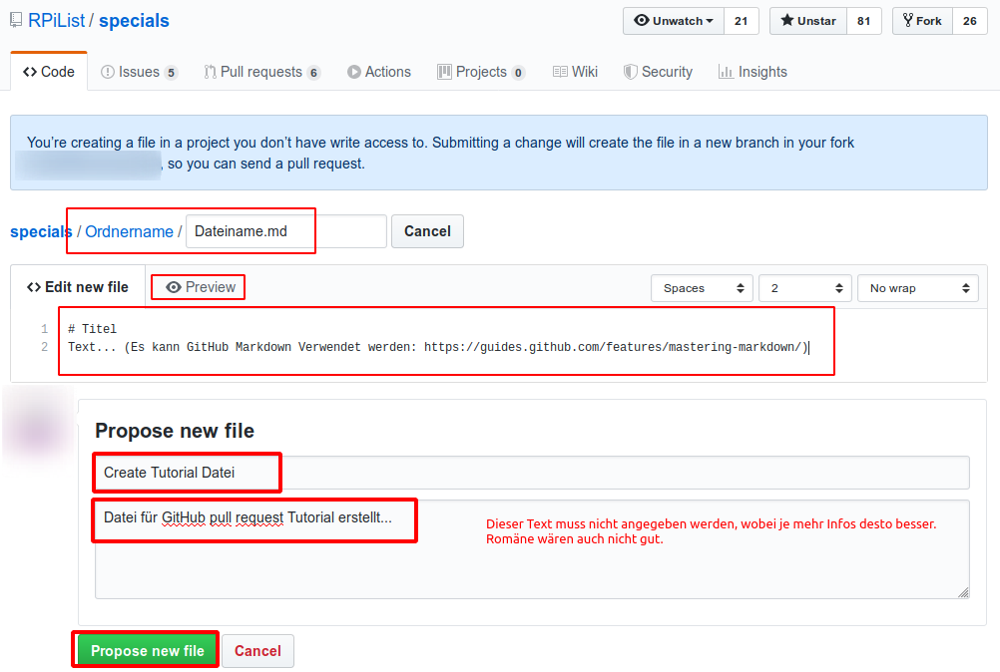

# GitHub Hilfeseite (Deutsch)

GitHub ist eine git Platform.

git wiederum ist eine Versionierungsverwaltung.

## Inhalt
[1. pull request ("Änderungen Vorschlagen")](#1-pull-request)

## 1. pull request
###### Änderungen vorschlagen
Mit einem pull request kann eine bereits gemachte Änderung z.B. "ins Haupt Repository" vorgeschlagen werden.
Falls eine "einfache Text Datei" (Markdown) in einem neuen Ordner erstellt werden soll, kann dies wie folgt gemacht werden:

1. [GitHub Repository mit dem GitHub Webclient öffnen](https://github.com/RPiList/specials)

2. Create new file

3. Ordnername und Dateiname angeben

Informationsquelle: [Stackoverflow Antwort 32620165](https://stackoverflow.com/questions/31861651/how-to-rename-a-directory-folder-on-github-website/32620165#32620165)

4. Ausfüllen und Absenden

